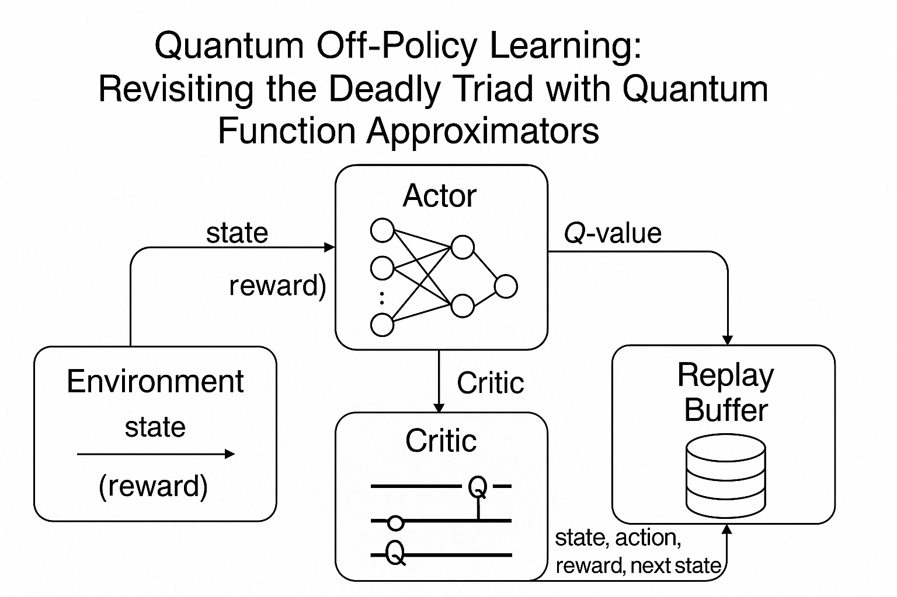

# Quantum-Enhanced SAC with PennyLane

This project implements a quantum-enhanced version of Soft Actor-Critic (SAC) for continuous control tasks, comparing classical neural networks with quantum neural networks in reinforcement learning.

## Overview

The deadly triad in reinforcement learning refers to the combination of function approximation, bootstrapping, and off-policy learning that can lead to instability. This project explores whether quantum neural networks might offer advantages in dealing with these challenges compared to classical neural networks.

The implementation compares:
- **Classical SAC**: Traditional SAC with neural network function approximators
- **Quantum SAC**: SAC with quantum-enhanced critic networks using PennyLane

## Requirements

- Python 3.6+
- PyTorch
- Gym
- NumPy
- TensorBoard
- PennyLane
- Matplotlib

Install dependencies with:
```bash
pip install torch gym numpy tensorboard pennylane matplotlib
```

## Project Structure

```
quantum_sac_deadlytriad/
│
├── main.py                          # Experiment launcher (classical/quantum selection)
├── config.py                        # Common hyperparameter settings
├── env/
│   └── make_env.py                  # Environment loader (Gym env + wrapper)
│
├── models/
│   ├── actor.py                     # Actor network (policy producer - classical MLP)
│   ├── critic_classic.py            # Classical critic (MLP Q-network)
│   ├── critic_quantum.py            # Quantum critic (PennyLane QNN)
│
├── rl/
│   ├── sac_agent.py                 # SAC agent (training, action selection)
│   └── replay_buffer.py             # Off-policy buffer
│
├── utils/
│   ├── logger.py                    # TensorBoard/training metrics logging
│   └── plots.py                     # Learning curve plotting
│
├── tests/
│   └── sanity_check.py              # Verification of model, env, and RL flow
│
└── README.md                        # Experiment description and results
```

## Training Flow

```
env.reset() 
→ actor(state) → action
→ env.step(action) → (state, action, reward, next_state, done)
→ replay_buffer.store(...)
→ critic/classic or quantum → Q_loss
→ actor → policy_loss
→ optimize
→ log and plot
```

## Usage

### Run Sanity Check

Before training, run the sanity check to verify that all components are working correctly:

```bash
python tests/sanity_check.py
```

### Train Classical SAC

```bash
python main.py --critic classic --steps 1000000 --env LunarLanderContinuous-v2
```

### Train Quantum SAC

```bash
python main.py --critic quantum --steps 1000000 --env LunarLanderContinuous-v2
```

### Test a Trained Model

```bash
python main.py --test --model_path logs/<experiment_name>/models/sac_best.pt --critic <classic or quantum>
```

### Compare Results

Generate comparison plots between classical and quantum critics after training:

```python
from utils.plots import plot_comparison

plot_comparison(
    classic_results={
        'steps': [...],
        'eval_rewards': [...],
        'training_time': ...,
        'inference_time': ...,
        'actor_params': ...,
        'critic_params': ...,
        'final_reward': ...
    },
    quantum_results={
        'steps': [...],
        'eval_rewards': [...],
        'training_time': ...,
        'inference_time': ...,
        'actor_params': ...,
        'critic_params': ...,
        'final_reward': ...
    },
    save_path='comparison.png'
)
```

## Quantum Circuit Design

The quantum critic uses a variational quantum circuit with:
- RY gates for state/action encoding
- RX, RY, RZ rotation gates for variational layers
- CNOT gates for entanglement
- Expectation value of PauliZ for measurement

## Key Findings

When running experiments, look for:

1. **Performance**: Does the quantum critic achieve comparable or better rewards?
2. **Sample Efficiency**: Does the quantum critic learn from fewer samples?
3. **Stability**: Does the quantum critic exhibit more stable learning curves?
4. **Parameter Efficiency**: Does the quantum critic require fewer parameters?
5. **Inference Speed**: What is the computational trade-off?

## Extending the Project

- Try different quantum encoding schemes
- Experiment with different quantum circuit architectures
- Test with different continuous control environments
- Implement quantum actor networks as well
- Add distributed training support

## References

- Soft Actor-Critic: https://arxiv.org/abs/1801.01290
- Quantum Machine Learning with PennyLane: https://pennylane.ai
- Reinforcement Learning: An Introduction (Sutton & Barto)
- Understanding the Deadly Triad in Deep RL: https://spinningup.openai.com/en/latest/spinningup/rl_intro.html#the-deadly-triad
- Quantum-enhanced reinforcement learning: https://arxiv.org/abs/2101.11014

---

## Architecture Diagram

The following diagram outlines the core architecture used in the Quantum SAC implementation. It highlights the interaction between the environment, actor, quantum critic, and replay buffer, and showcases how data flows between components in both classical and quantum setups.



> If the image doesn't appear, make sure to place the file at:  
> `quantum_sac_deadlytriad/assets/quantum_sac_architecture.png`

You can download the image from the [full-resolution version here](../mnt/data/A_flowchart_diagram_titled_%22Quantum_Off-Policy_Lea.png).

---

## Citation

If you use this codebase or architecture in your research, please cite as:

```bibtex
@misc{quantumsac2025,
  author       = {Your Name},
  title        = {Quantum-Enhanced Soft Actor-Critic for Overcoming the Deadly Triad in Off-Policy RL},
  year         = {2025},
  howpublished = {\url{https://github.com/your-username/quantum_sac_deadlytriad}},
}
